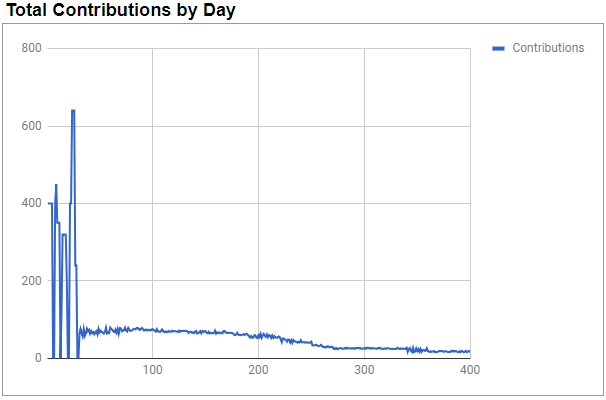
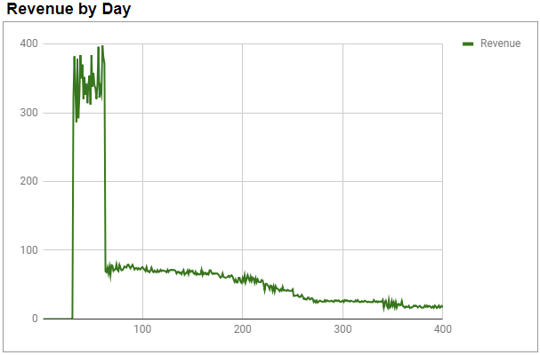
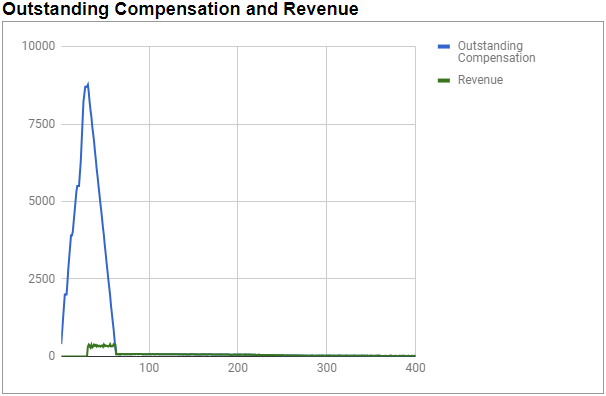

# City Guide Simulation Overview
The following writeup describes a simulation of a hypothetical use of the cooperative license. The simulation is of a city guide which would be used by visitors to a city to learn what's worth seeing, how to get around, etc. The simulation models the project of writing the guide by two individuals and then published to customers electronically. 

Each customer is charged $2.00 for access to the guide and from that the publisher receives 20%, or $0.40, per unit sale. The remainder of revenue pays the contributors. Once they are paid in full, then the license switches to open source and is free, though the publisher still charges $0.40 per unit for distribution. 

The simulator is modeled as a sequence of days for four hundred days. On each day there are potential contributions and possible revenue. Each day, contributors are paid from the simulated revenue and tallies are kept of what they were paid and what their outstanding, uncompensated balances are. 

## Simulation Configuration

The simulation uses distribution graphs as configuration of simulated events. A distribution graph is provided as text in a form which can be parsed into an array of ranges indexed by day. Each range represents the bounds of a random number which simulates an actual value for a quantity of compensation or revenue. An 'x' in a cell indicates that its corresponding value is in the range of possibilities for a quantity. 

The distribution graph below depicts what might be a typical work week for a contributor on a project. The graph has eight rows and seven columns. Each row represents an hour of a work day, and each column a day in a week. 

```
  -------
8 x
7  x
6  x
5  x
4   xx
3
2
1
  -------
```

In the distribution graph above, the individual works 8 hours on Monday; a random number between 5 and 7 hours on Tuesday; 4 hours on Wednesday and Thursday; and no other contributions the rest of the week.

## Contributors
The simulation models contributions from three sources. Two are individuals who work on creating the guide itself. The third contribution is from a publisher which makes the guide available for customers and charges a per unit fee of $0.40. The individuals charge by the hour. This simulation does not model an interest rate to be paid during the time a contribution goes uncompensated. That will be done in a future simulation.

The two contributors are Alice and Bob. They work for 30 days based on the distribution graphs below. Alice charges $50.00/hour and Bob charges $30.00.

### Alice:
```
	  ----------------------------
	8 xxxxx                xxxxx
	7        xx
	6        xx  
	5        xxxxx  
	4          xxx  xxxxx
	3
	2
	1
	  ----------------------------
```

### Bob:
```
	  ----------------------------
	8                        xxxxx
	7        
	6          
	5        xxxxx  
	4              xxxxx
	3
	2
	1
	  ----------------------------
```

### Publisher:
The contribution of making the guide available to customers by the publisher is modeled as a $0.40 fee per unit sold.
	
Using the configuration above, the following contributions are simulated and charted below.



For the first 30 days, two contributors work on the project. Once their work is complete the guide is made available for purchase. The contributions past the 30th day represent the contributions of the publisher at $0.40 per unit sold.

## Revenue
Revenue is collected from customers for a fee of $2.00. Unit sales are represented by the distribution graph below. The scale of the graph is increased for each row and column by 10, so each row represents 10 unit sales, and each column represents 10 days of simulation.

```
   ----------------------------------------
20    xxxxxx
19    xxxxxxxx
18    xxxxxxxxxxxxxx
17    xxxxx  xxxxxxxx
16    xxxx      xxxxxxxx
15    xxx           xxxxx
14    x               xxx
13                    xxxx
12                       xx
11                       xxx
10                       xxx
9                           x
8                           xx
7                            xxxxxxxxxx
6                             xxxxxxxxx 
5                                    xxxxxx
4                                    xxxxxx
3    
2    
1    
   ----------------------------------------
```

Using the configuration above, the following revenue is simulated and charted below:



There is no revenue for 30 days while the guide is being written. Once it is made available, demand is quite high and sales vary between 300 and 400 dollars a day. Once the revenue has compensated the writers the price is dropped to just the fee for distribution so revenue drops significantly.

## Conclusion
Charting both the total uncompensated contributions and revenue together shows how contributors are compensated.



The graph uncovers an interesting observation, that the people who buy early are forced to pay for the work that others will enjoy at a lower price later. While this is not necessarily bad, since they also get use of it early, it would be reasonable to try to stretch payment across a broader set of customers. Many schemes could be used to achieve this. One simple approach would be to lower the price. However, it is never known exactly how many items will sell, so setting the price too low would jeopardize full compensation. Another approach would be to consider the price paid for the guide as both a payment for compensation and an investment to be paid back to the purchaser from future revenue. Perhaps $1.00 would go to pay the contributors but $1.00 would be added as a contribution to be paid back from future revenue. Once some threshold of some limit of outstanding compensation has been met, or some time period, or maybe some number of initial sales, is met, then future sales would not include a compensation component.

One could also imagine dynamic pricing set by a vote of contributors with an outstanding stake in future sales. It is important to note, though, that the license demands transparency of compensation. Customers are stakeholders in the model. They can detect what the creators have received in payment for the work. If this work is one of many in a network of contributors, they could be given some choice as to where their money would be spent and might choose to limit total compensation for this particular work.

Blockchain computers, like RChain, will provide inexpensive, fast transactions of money transfer making micropayment business models possible. New business structures can be coded which take advantage of this capability. Trusting that smart contracts will execute as written will give stakeholders confidence to enter into agreements that would be too costly and too complicated to draft with current day technology.


